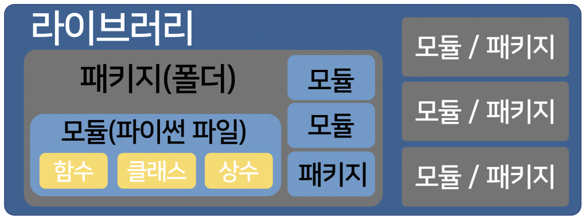

# 모듈

## 모듈의 개념

함수, 상수 또는 클래스를 모아놓은 집합체

* 모듈 : 클래스, 함수, 상수의 집합
* 패키지 : 하위 패키지 및 모듈의 집합
* 라이브러리: 패키지 및 모듈의 집합



## 구문 형식

```py
import math
import foo as my_module
from bar import my_func

del math
```

## 모듈의 등록 확인

* `dir()` : 네임스페이스에 등록되어 있는 모든 이름들을 리스트로 반환
* `help()` : 대화형 도움말 시스템 호출 또는 클래스나 메소드의 사용방법 반환

## 네임스페이스의 이해

특정 객체를 이름에 따라 구분할 수 있는 범위

* 지역 네임스페이스 : 함수 또는 메소드 내의 이름 공간
* 전역 네임스페이스 : 모듈 전체에 통용되는 이름 이름 공간
* 빌트인 네임스페이스 : 모든 코드의 범위

## 유용한 모듈

* math 모듈 : 수학적 계산 문제를 해결하기 위한 수학 함수 및 상수의 집합
* random 모듈 : 난수 관련된 생성 기능을 제공하는 모듈
* time 모듈 : 에포크 시간을 얻어 다양한 형식으로 표시하는 기능 제공
